# TypeScript Type

## Static
Static Types dibagi menjadi 2 sub kategori
### 1. Built In
Ada 5 Built in data types
- Number
- String
- Boolean
- Void
- Null
### 2. User Defined
Ada 7
- Array
- Touple
- Enum
- Functions
- Class
- Interface

## Generic
Penjelasan Coming Soon
## Decorator
Penjelasan Coming Soon